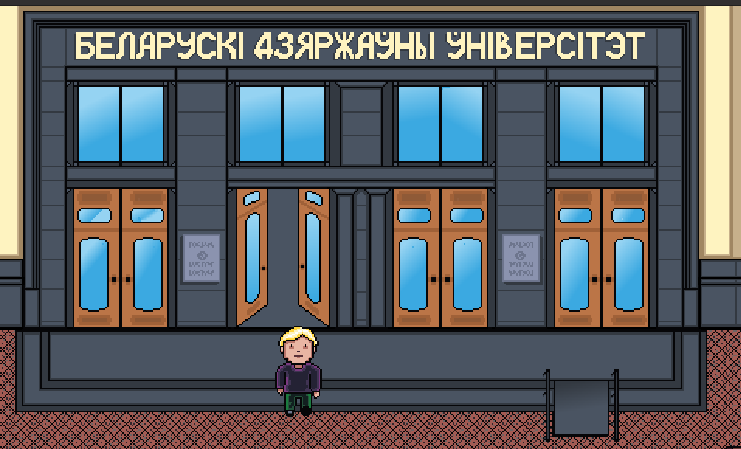
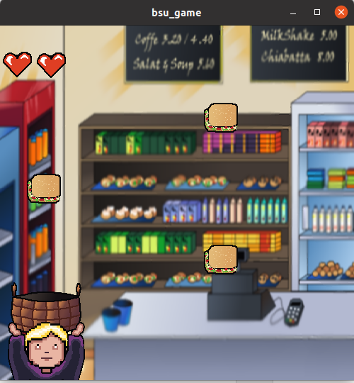

## Day at BSU university

This is our student project made in spring 2021. 
It's game, that simulates a day at our university. 
The player has to explore its interiors, pass a meticulous guard, make it through a
dark labyrinth and master difficult minigames.

The game is written in C++ and uses the QT framework for windowing and graphics.

